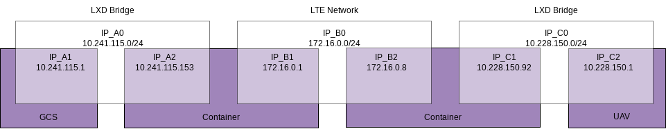

# uav-scope-host

This repository contains files used to configure and launch SCOPE containers to manage USRPs and setup an LTE connection between a gnb and a ue.
It is supposed to be used together with [uav-scope-cont repository](https://github.com/pietrbr/uav-scope-cont/).

To know more about SCOPE, see [this repository](https://github.com/wineslab/colosseum-scope).

## High-Level Scheme

The following scheme shows the three networks that are created in the setup. Only one (in the centre) is the actual LTE network. The two other networks are virtual networks created by the lxd containers and are used to enable the communication between the host systems (GCS or UAV) and the containers that run the SCOPE software to establish and manage the network.

The file `addIPvars.sh` is used to add the IP variables for the computers in the system as system variables and thus simplify and automatize the process of setting up new computers.

## Instructions to setup the network

Assuming the software is installed properly, it is sufficient to run the `BS.sh` scripts on the BS, or the `UE.sh` on the UE.
